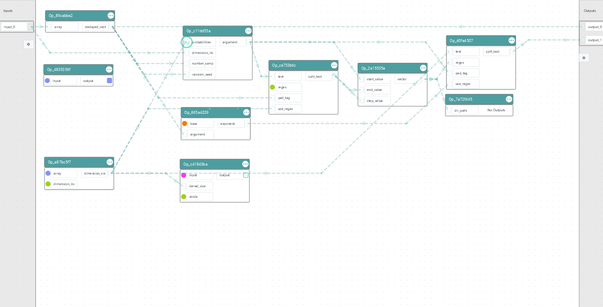

# Graph Methods 

## Project Overview
This project includes various methods for analyzing graphs features. Graphs are graded based on various features.

### Scoring Factors:
- **Directionality and Hierarchy Compliance**: 10%
- **Intersections**: 35%
- **Spacing Uniformity**: 10%
- **Angle Cleanliness**: 10%
- **Excessive Nodes**: 15%
- **Blocked Nodes**: Deducts 1 point each time 
- **Touching Operations**: 15%
- **Clustering**: Deducts 1 point each time 
- **Symmetry**: 5%

### Example of Graph Graded:

The graph above receives a 72.6.
Below is the explanation for the scoring factors: 

- 1.0 stacking score because there was no occurence of improper stacking (i.e. links being stacked coming from different operations and data types)
- 1.0 directionality score because there aren't any backward/right to left facing links
- 0.25 spacing score because this graph
- 0.65 alignment score because while most operations were in-line vertically, some weren't in-line horizontally
- 1.0 touching score because no operations were touching each other
- 0.47 angle score because there were a variety of different angles
- 0.25 node score because a lot of lines used 1 or more nodes 
- 0.23 symmetry score because was an imbalance between the operations and nodes on the left vs right side and top vs bottom side of the graph (Hard to be perfectly symmetrical so it's expected to get a good score)
- -2 for clustering score because there were two occurences of clustering (one time in the area between Op_89cabbe2 and Op_c11dd55a vertically and another time between Op_2e15535e and Op_d0fe4507)
- 0 for nodes blocked because no nodes were hidden behind operations

## Running Project
Just call analyze_graph(graph) with your loaded graph JSON as the parameter and store it as a variable. The function returns a dictionary of information about the graph. 
Here's what to call for the different scoring factors (Let's say we stored function returns as result in this case):

- Final Score: result["Final Score"]
- Directionality and Hierarchy Compliance: result["Directionality Score"]
- Intersections: result["Stacking Score"]
- Spacing Uniformity: result["Spacing Score"]
- Angle Cleanliness: result["Angle Score"]
- Excessive Nodes: result["Node Score"]
- Blocked Nodes: result["Nodes Blocked Deduction"]
- Touching Operations: result["Touching Score"]
- Clustering: result["Clustering Deduction"]
- Symmetry: result["Symmetry Score"]

Create a virtual environment to run this code:

```bash
python -m venv .venv

